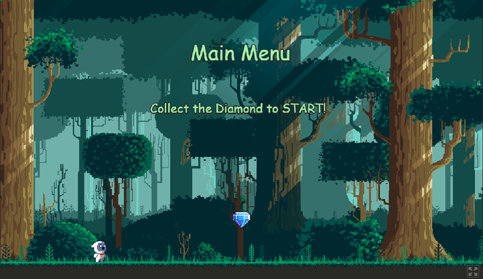

# Adventure Game (PhaserJS)

A browser-based 2D adventure game built using the **PhaserJS framework**.  
This project demonstrates game architecture, scene management, asset loading, and interactive gameplay using a modern JavaScript game engine.

Deployed at: https://truelander12.itch.io/adventure-game

---

## 🎮 Overview

This project explores core game development concepts using PhaserJS, including:

- Scene creation and lifecycle management
- Sprite movement and animation
- Collision detection
- Event handling
- Game state logic
- Structured game loop implementation

The goal of this project was to deepen understanding of JavaScript application architecture in an interactive environment.

---

## 🛠️ Tech Stack

- **PhaserJS** – 2D game framework
- **JavaScript (ES6+)**
- **HTML5**
- **CSS3**

---

## 🚀 Features

✔ Player movement and controls  
✔ Scene-based game structure  
✔ Sprite rendering and animation  
✔ Collision detection (if implemented)  
✔ Interactive objects  
✔ Dynamic game updates  

---

## 🧠 What This Project Demonstrates

This repository highlights:

- Working with a JavaScript framework (PhaserJS)
- Understanding of game loops and rendering cycles
- Event-driven programming
- Managing state within interactive applications
- Structuring code into logical components
- Handling assets and sprites efficiently

## 📸 Gameplay Preview

